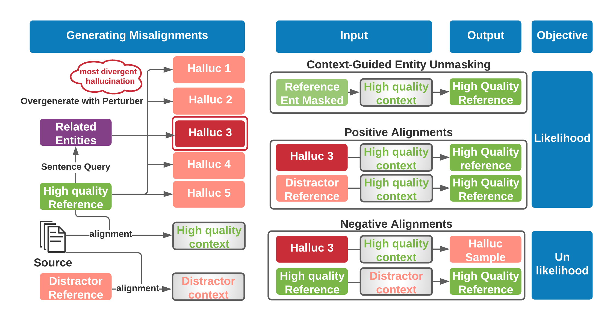

# ReviseSum

This is the README for the paper "Learning to Revise References for Faithful Summarization" by Griffin Adams, Han-Chin Shing, Qing Sun, Christopher Winestock, Kathleen McKeown, and Noémie Elhadad.  This research was done while Griffin (PhD student at Columbia University) was an intern with the [Amazon Comprehend Medical](https://aws.amazon.com/comprehend/medical/) team.

If you have any questions about the paper or issues running the code, please don't hesitate to contact griffin.adams@columbia.edu or raise an issue on GitHub!  We will try to respond as promptly as possible.

## High-Level Approach

We propose a new approach to improve reference quality which involves revising--not remove--unsupported reference content. Without ground-truth supervision, we construct synthetic unsupported alternatives (`/perturber`) to supported sentences and use contrastive learning to discourage/encourage (un)faithful revisions (`/ref_reviser`). At inference, we vary style codes to over-generate revisions of unsupported reference sentences and select a final revision which balances faithfulness and abstraction. We extract a small corpus from a noisy source (`/preprocess`)--the MIMIC-III clinical notes from the EHR--for the task of summarizing a hospital admission from multiple notes. We fine-tune BART and Longformer models on original, filtered, and revised data (`/gen_transformers`), and find that training on revised data is the most effective data-centric intervention for reducing hallucinations.

A high-level diagram of the revision training strategy is shown below.



## Code Setup

```
pip install -e .
```

To be able to run models and sync results, you will need to create an account on [Weights & Biases](https://wandb.ai/).  Otherwise, please run all models with `-offline` flag.

```
pip install wandb
wandb login
```

Feel free to change the Weights & Biases endpoints in `ref_reviser/main.py` and `gen_transformers/main.py` settings to point to your own personal **project** and **entity**.  Otherwise, they will be available at [Our Public Reference Revision Project](https://wandb.ai/griffinadams/ref-improve) and [Our Public Summarization Project](https://wandb.ai/griffinadams/mimic-sum), respectively.

```angular2html
logger = pl_loggers.WandbLogger(
    name=args.experiment,
    save_dir=experiment_dir,
    offline=args.debug or args.offline,
    project='mimic-sum',
    entity='griffinadams',
)
```

### Entity Extraction and Linking

For entity extraction and linking, we use the publicly available API provided by Amazon Comprehend Medical.  Here are some [instructions](https://docs.aws.amazon.com/comprehend-medical/latest/dev/comprehendmedical-gettingstarted.html) on how to get started (only Step 1 is necessary and Step 4 is helpful to show the output format).  If you would like to change the AWS region, please go to `preprocess/entity/extract_ents.py` and modify the `region_name` field:

```angular2html
def get_prod_hera_client():
    client = boto3.client(service_name='comprehendmedical', region_name='us-west-2')
    return client
```

New users receive a free tier of 8.5 million characters, which should be enough for evaluating summaries, but may not cover perturber pre-training and inference. Please visit [pricing page](https://aws.amazon.com/comprehend/medical/pricing/) for more information.  You can also replace the function `#get_ents` in `preprocess/entity/extract_ents.py` with custom entity extraction code, i.e., [SciSpacy](https://allenai.github.io/scispacy/), [MedCAT](https://github.com/CogStack/MedCAT), [https://ctakes.apache.org/](cTAKES), or [CLAMP](https://clamp.uth.edu/). If you override `#get_ents`, it must return an object with the following keys: `icd`, `rx`, and `ent`.  *icd* entities are diagnoses, *rx* stands for **RxNorm** which provides normalized names for clinical drugs, and *ent* returns the output from ACM's [`DetectEntitiesV2`](https://docs.aws.amazon.com/comprehend-medical/latest/api/API_DetectEntitiesV2.html), which inspects clinical text for a variety of medical entities and returns specific information about them such as entity category, location, and confidence score on that information.  These can produce overlapping spans and the code prioritizes ICD and RXNorm entities over the *ent* category.  Given that this division is unique to ACM, we recommend including diagnoses in *icd*, all medications in *rx*, and all other entity categories in *ent*.  The values of *icd, rx, ent* are each lists, where a single item represent a single entity span and must include the following keys:

```
Type: semantic type of entity
BeginOffset: the string index of the beginning of the entity span
EndOffset: the string index of the end of the entity span
Text: raw mention span of the entity, i.e, 'Heparin'.
Category: High-level category to decide which semantic groups get filtered out.  We only filter out an entity if its category is in {'ANATOMY', 'TIME_EXPRESSION', 'PROTECTED_HEALTH_INFORMATION'}.
```

**Type** must be one of the following keys in `ENT_TYPE_MAP` and will be mapped to one of 5 categories:

```angular2html
ENT_TYPE_MAP = {
    'DX_NAME': 'dx',
    'PROCEDURE_NAME': 'procedure',
    'TREATMENT_NAME': 'treatment',
    'TEST_NAME': 'test',
    'BRAND_NAME': 'med',
    'GENERIC_NAME': 'med'
}
```

The `Type` information is only needed for perturber pre-training so if you are just using entities for summary or revision analysis, feel free to put a dummy category for each `Type`, i.e., `DX_NAME`.

## Overview

Please see separate READMEs for

1. Preprocessing MIMIC-III data into a hospital-course summarization corpus (`/preprocess`).  NB: You will need to request access from PhysioNet to download the raw data using this [link](https://physionet.org/works/MIMICIIIClinicalDatabase/access.shtml).

2. Learning to generate synthetic hallucinations with BART (`/perturber`).

3. Learning to revise unsupported reference sentences with contrastive learning (`/ref_reviser`).

4. Running summarization models (BART and Longformer) on MIMIC-III revised, original, and filtered references (`/gen_transformers`).  Also provides flags to train by controlling hallucinations ([Fillippova, 2020](https://aclanthology.org/2020.findings-emnlp.76.pdf)) and with Loss Truncation ([Kang and Hashimoto, 2020](https://aclanthology.org/2020.acl-main.66/)).
